# awsome-macro-photography links for Canon R7 and others

This is the awsome macro photography links page. If you like to add things, please either create a pull request or send e-mail to laszewski@gmail.com

## Camera CCAPI

* Canon video ccapi wifi <https://www.youtube.com/watch?v=NwFHUGYzC3Y>
* Canon video SDK usb <https://www.youtube.com/watch?v=aqW9pM0Je7Q>

## Camera Cannon issue with Ventura

* EOS utility 3, does not work on macOS 13 with apple silicone <https://community.usa.canon.com/t5/Camera-Software/In-compatibility-of-EOS-Utility-with-MacOS-Ventura/m-p/394189#M13844>
* CCAPI activation does not work on macOS 13 with apple silicone

## In camera bracketing  with R7

Recent cameras such as the Canon R7 have fetures to allow Foocus bracketing. The advantage is that no specialized equipment is needed, but a tripod so the image is more stable. 
Some tutorials that show how to do this are available on youtube, by various youtubers. I liked the vide from Fabian Foop as it explains how to do it and also identifies how to set the camera up easily.

* [Fabian Fopp video R7 focus brackiting](https://www.youtube.com/watch?v=bJOtUBSCWbQ) [German](https://www.youtube.com/watch?v=dF02EDDsS1w)
* [Phill Thatch focus bracketing](https://www.youtube.com/watch?v=_lSnZARKxrA)

## Macro Rails

### Mechanical Macro Rails

prices fund Januarry 2022, rounded up to the next dollar value. Shipping cost may or may not be included.

| ID  | Image                                                | Price   | Description                                                                                                         | Shop                                                                                                                                                                                                                   |
|-----|------------------------------------------------------|---------|---------------------------------------------------------------------------------------------------------------------|------------------------------------------------------------------------------------------------------------------------------------------------------------------------------------------------------------------------|
| R1  | 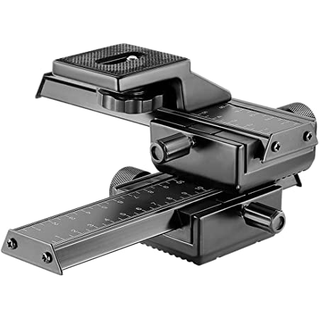             | ~ $16   | Shoot 4 way, similar to Neewer Pro 4 - plate. Not sure if it is the same. There are many of them that looklike this | [Amazon](https://www.amazon.com/SHOOT-Aluminum-Focusing-Close-up-Photography/dp/B01N0KNK69/ref=sr_1_4?keywords=macro+focusing+rail&qid=1673610984&sr=8-4)                                                              |
| R2  | 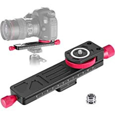   | $33     | Neewer Worm Drive                                                                                                   | [Amazon](https://www.amazon.com/Neewer-Wormdrive-Focusing-Close-up-Shooting/dp/B07FSKRRX9/ref=sr_1_2?crid=IZAZ31O0FAP7&keywords=neewer+worm+drive&qid=1673611150&sprefix=newer+worm+drive%2Caps%2C170&sr=8-2)          |
| R3  | 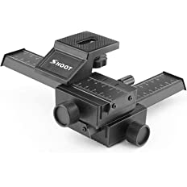    | ~$40    | Neewer 4 - plate                                                                                                    | [Amazon](https://www.amazon.com/Neewer-Focusing-Close-Up-Shooting-Standard/dp/B009SJ7UWU/ref=sr_1_2?keywords=macro+focusing+rail&qid=1673610572&sr=8-2)                                                                |
| R4  | 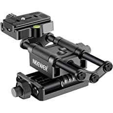      | $60     | Neewer Pro 4 - 2 beam                                                                                               | [Amazon](https://www.amazon.com/Neewer-Focusing-Compatible-Camcordes-Close-Up/dp/B07WK11QKW/ref=sr_1_1?keywords=macro+focusing+rail&qid=1673665158&sr=8-1&ufe=app_do%3Aamzn1.fos.006c50ae-5d4c-4777-9bc0-4513d670b6bc) |
| R5  | 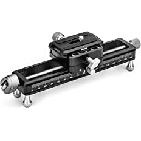          | $130    | NiSI NM-180                                                                                                         | [Amazon](https://www.amazon.com/NiSi-Focusing-NM-180-Degree-Rotating/dp/B08BCCFQC3/ref=sr_1_5?keywords=macro+focusing+rail&qid=1673610572&sr=8-5&ufe=app_do%3Aamzn1.fos.f5122f16-c3e8-4386-bf32-63e904010ad0)          |
| R6  | 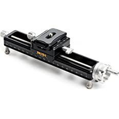          | $200    | NiSI NM-200                                                                                                         | [Amazon](https://www.amazon.com/NM-200-Macro-Focusing-Close-Up-Photography/dp/B0B4Z5TC8X/ref=sr_1_3?keywords=macro+focusing+rail&qid=1673610572&sr=8-3&ufe=app_do%3Aamzn1.fos.f5122f16-c3e8-4386-bf32-63e904010ad0)    |

### Motorized Macro Rails

| ID  | Image                                                                                                                                                                     | Price | Description | Shop |
|-----|---------------------------------------------------------------------------------------------------------------------------------------------------------------------------| --- | --- | --- |
| MR1 | 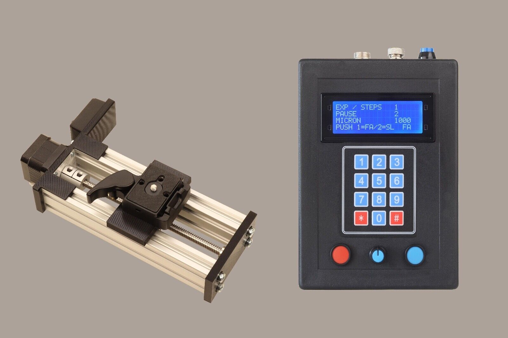  | $140 | AUTOMATED MOTORIZED FOCUS STACKING MACRO  | [ebay](https://www.ebay.com/itm/202754159812?_ul=E) |
| MR2 | 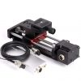          | $320 | WeMacro Rail | [WeMacro](https://www.wemacro.com/US/index.php/product/wemacro-rail-with-power-bank-cable-for-outside) |
| MR3 | 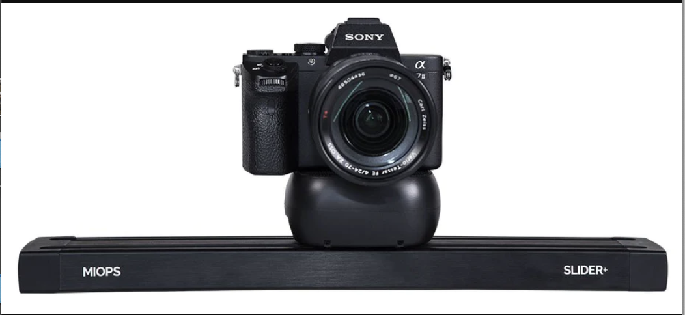            | $400 | MIOPS Slider+ It is a slider that functions also as macro rail with 1.41um resolution | [MIOPS](https://www.miops.com/products/slider)  |
| MR4 | 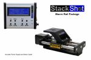        | $579 | STACKSHOT MACRO RAIL PACKAGE | [Cognisys](https://cognisys-inc.com/stackshot-macro-rail-package.html) |
| MR5 | 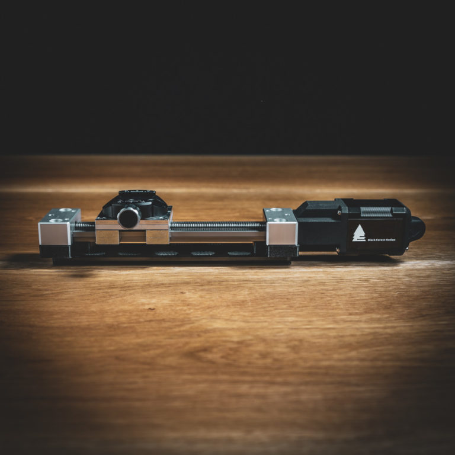 | €673/€901 | Black Forest Motion | [Black Forest Motion](https://blackforestmotion.com/en/products/macro-slider/) |
| MR6 | 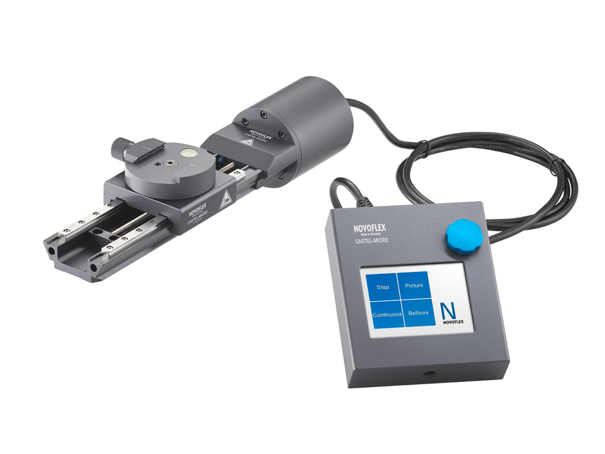 | €1900 | Novoflex Castle Micro | [Novoflex](https://www.novoflex.de/en/focusing-rack-castel-micro/castel-micro-en.html) |
| MR7 |  | €3043 | Novoflex AUTO STEP MOTOR STACKING RAIL SYSEM | [Novoflex](https://novoflexus.com/auto-step-motor-stacking-rail-sysem/) | 

## Plates and quickreleases

| ID  | Mount     | Image                                          | Price | Description                                               | Shop                                                                                                                                                                                                                                                                                     |
|-----|-----------|------------------------------------------------|-------|-----------------------------------------------------------|------------------------------------------------------------------------------------------------------------------------------------------------------------------------------------------------------------------------------------------------------------------------------------------|
| P1  | ArcaSwiss | 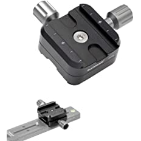 | $19   | Koolehaoda QR-50B Quick Release Plate Clamp Double Clamp  | [Amazon](https://www.amazon.com/gp/product/B096DM6G7H/ref=ppx_yo_dt_b_asin_title_o04_s00?ie=UTF8&th=1) |

### Rental

* [Stackshot 3x](https://www.lensrentals.com/rent/cognisys-stackshot-3x-macro-rail-package) ($83 for 7 days) remember sending back may take time.

### DIY

* [Adruino based](https://projecthub.arduino.cc/MacroPhotoFan_2004/89d7e85e-1c44-4d95-986b-eb9992d1ebb6)
* [On Printables](https://www.printables.com/model/219042-motorized-camera-rail-for-macro-photography/collections)
* [OpenMacroRail](https://github.com/appliedprocrastination/Motorized-Macro-Rail)
* [Instructables Automated Macro Focus Rail](https://www.instructables.com/Automated-Macro-Focus-Rail/)
* [Faststacker 2.0](https://pulsar124.fandom.com/wiki/Fast_Stacker)

### Shops

I can not attest to if these sites are reputable sites

* [FlaMicoz](https://flamicroz.com/en/39--macro-focusing-rail-) Has a variety of rail. Pries in Euro 
* [Keh used](https://www.keh.com/shop/search?q=macro+rail)
* [Ali express](https://www.aliexpress.com/w/wholesale-macro-rail.html) I never ordered from Ali express
* [MJKZZ.de A variety of macro rails](https://www.mjkzz.de/collections/focus-stacking-rails) I do not know anything about this store. Their QOOL Rail (Set incl. USB-Controller) starts at €380

## Lenses

* [Laowa lens collection, look for Macro](https://www.venuslens.net/)

### Microsopy Lenses and adapters

| ID  | Image                                           | Price                                                                       | Description                                                              | Shop                                                                                                    |
|-----|-------------------------------------------------|-----------------------------------------------------------------------------|--------------------------------------------------------------------------|---------------------------------------------------------------------------------------------------------|
| M1  | 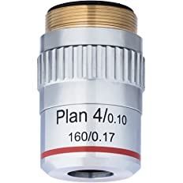 | $23                                                                         | AmScope 4X Plan Achromatic Objective Lens with Knurled Ring              | [Amazon](https://www.amazon.com/gp/product/B01G4CCGRC/ref=ppx_yo_dt_b_asin_title_o03_s00?ie=UTF8&psc=1) |
| M2  | 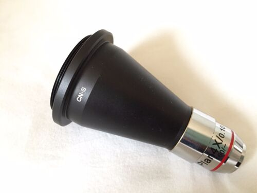 | $20                                                                         | RMS Thread for Microscope objective to M42 x1mm Converter Cone Adapter   | [ebay](https://www.ebay.com/itm/144442444704)                                                           |
| M3  | 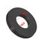 | $9 | M42 to RMS Adapter Ring Microscope Objective RMS Thread to M42 Interface | [ebay](https://www.ebay.com/itm/273877780529)                                                           |

A suitible build can be achieved with the following alternative builds

* M1, M3 and E1 = $23 + $9 + $26 = $58
* M1, M2 and E1 = $23 + $20 + $26 = $69 

You will still need an m42 to camera adapter, which are typically $10-15. If you can get a black adapter
not a silver one.

## 3-D printed versions that have worked

## Fixed Length Extension Tubes

| ID   | Mount            | Image                                             | Price          | Description                                                                                                                                                                                    | Shop                                                                                                                                                                                                                                                                                         |
|------|------------------|---------------------------------------------------|----------------|------------------------------------------------------------------------------------------------------------------------------------------------------------------------------------------------|----------------------------------------------------------------------------------------------------------------------------------------------------------------------------------------------------------------------------------------------------------------------------------------------|
| E1   | M42 Manual       | 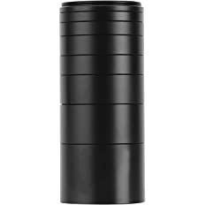       | $26            | M42 Extension Tubes 3/5/7/10/15/20/30mm.  Warning, the 30 and 20mm did not fit properly in the m42 mount, but they do fit between each other. you need to find a combination that fits nicely. | [Amazon](https://www.amazon.com/gp/product/B09C11L5QL/ref=ppx_yo_dt_b_asin_title_o00_s00?ie=UTF8&psc=1)                                                                                                                                                                                      |
| E2   | M42 Manual       |           | $9             | Neewer Aluminum Alloy Lens Mount Adapter for M42 Lens to Canon EOS Camera                                                                                                                      | [Amazon](https://www.amazon.com/gp/product/B01HPMY8YE/ref=ppx_yo_dt_b_asin_title_o01_s00?ie=UTF8&psc=1)                                                                                                                                                                                      |
| E3   | EF Automatic     | 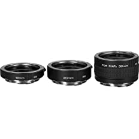      | $140/$75 used  | Kenko AF Set                                                                                                                                                                                   | [Amazon](https://www.amazon.com/Kenko-Auto-Extension-Canon-Mount/dp/B000U8Y88M)                                                                                                                                                                                                              |
| E4   | EF Automatic     | 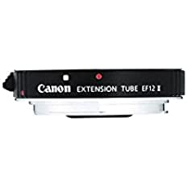   | $90            | Canon Extension Tube EF 12 II                                                                                                                                                                  | [Canon](https://www.amazon.com/Canon-Extension-Tube-Digital-Cameras/dp/B0000DZ5OE/ref=sr_1_1?crid=BXWP4VPTAYYE&keywords=Canon+Extension+Tube+EF+12+II&qid=1673616039&sprefix=canon+extension+tube+ef+12+ii%2Caps%2C108&sr=8-1)                                                               |
| E5   | EF Automatic     | 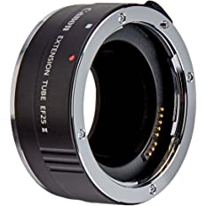  | $125-$145      | Canon Extension Tube EF 25 II                                                                                                                                                                  | [Canon](https://www.amazon.com/Canon-Extension-Tube-Digital-Cameras/dp/B0000U1N38/ref=sr_1_3?crid=1JKOJ6RS20Y94&keywords=Canon+Extension+Tube+EF+25+II&qid=1673615812&sprefix=canon+extension+tube+ef+25+ii%2Caps%2C158&sr=8-3&ufe=app_do%3Aamzn1.fos.f5122f16-c3e8-4386-bf32-63e904010ad0)  |
| ERF1 | RF Automatic     | 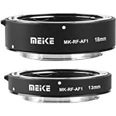   | $40            | Meike MK-RF-AF1 13mm + 18mm, The rings are a bit wobbely                                                                                                                                       | [Amazon](https://www.amazon.com/Meike-MK-RF-AF1-Extension-Adapter-Cameras/dp/B07T1CY6BS/ref=sr_1_6?crid=2TRR5CVEO1CV&keywords=Canon+Extension+Tube&qid=1673615882&refinements=p_n_condition-type%3A2224371011&rnid=2224369011&s=electronics&sprefix=canon+extension+tube%2Caps%2C140&sr=1-6) |
| ERF2 | RF Automatic     | 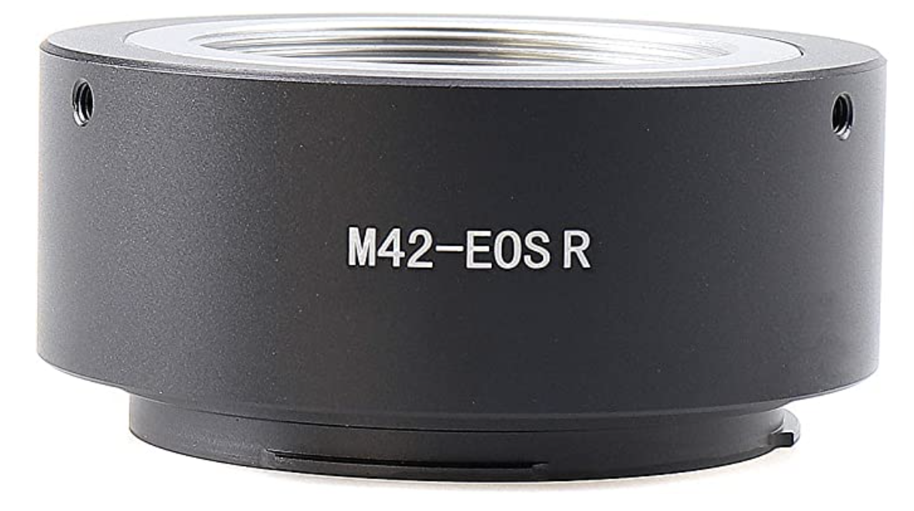 | $12            | Hersmay M42-EOSR M42 to RF Lens Mount Adapter M42 Lens for Canon EOS R R5 R5C R6 RP Full Frame Mirrorless Camera                                                                               | [Amazon](https://www.amazon.com/gp/product/B08CKR8HJ7/ref=ppx_yo_dt_b_asin_title_o06_s00?ie=UTF8&th=1)                                                                                                                                                                                       |
| E6   | M42 Manual       | 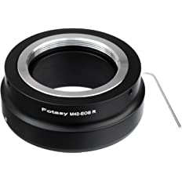  | $14            | Fotasy M42 to Cannon EOS RF                                                                                                                                                                    | [Amazon](https://www.amazon.com/gp/product/B07KZ877K7/ref=ppx_yo_dt_b_asin_title_o00_s00?ie=UTF8&psc=1)                                                                                                                                                                                      |
| E7   | T and M42 Manual | 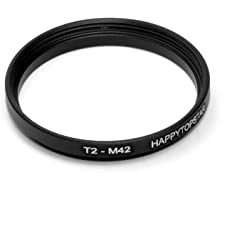          | $9             | Metal T2 to M42 Male to Female 42mm                                                                                                                                                            | (Amazon)[https://www.amazon.com/gp/product/B07QFS4WW9/ref=ppx_yo_dt_b_asin_title_o02_s00?ie=UTF8&psc=1]                                                                                                                                                                                      | 
| E8   | T to RF Manual   | 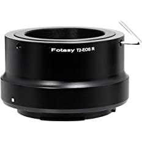      | $13            | Fotasy Adjustable T2 T Mount Lens to Cannon EOS RF Adapter                                                                                                                                     | (Amazon)[https://www.amazon.com/gp/product/B07Q279XF8/ref=ppx_yo_dt_b_asin_title_o02_s01?ie=UTF8&psc=1]                                                                                                                                                                                      | 

### Variable Extensions

| ID  | Mount | Image                                                 | Price   | Description                                                                                                                                                                                                       | Shop                                                                                                    |
|-----|-------|-------------------------------------------------------|---------|-------------------------------------------------------------------------------------------------------------------------------------------------------------------------------------------------------------------|---------------------------------------------------------------------------------------------------------|
| V1  | M42   | 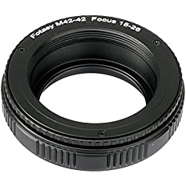      | $20-$30 | Fotasy M42 Helicoid                                                                                                                                                                                               | [Amazon](https://www.amazon.com/Fotasy-Helicord-Focusing-Helicoid-Extention/dp/B00CPUSYLA?th=1)         |
| V2  | EOS   | 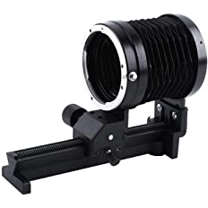 | $32     | Vbestlife Macro Bellows. Not that stable, but good if you like to change macro factor. Not automatic. The screw that fixes it needs to be screwed in and out multiple times so that it loks to the plastic beam.  | [Amazon](https://www.amazon.com/gp/product/B07PZ86Q15/ref=ppx_yo_dt_b_asin_title_o05_s00?ie=UTF8&psc=1) |
 

### Flash

| ID  | Mount | Image                                               | Price | Description    | Shop                                                                                                    |
|-----|-------|-----------------------------------------------------|-------|----------------|---------------------------------------------------------------------------------------------------------|
| F1  | Canon | 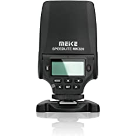     | $70   | Meike MK-320C  | [Amazon](https://www.amazon.com/gp/product/B01N7LWTCZ/ref=ppx_yo_dt_b_asin_title_o04_s00?ie=UTF8&psc=1) |
| F2  | Canon | 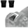 | $8    | R7 Flash cover | [Amazon](https://www.amazon.com/gp/product/B0BCPC1RTP/ref=ppx_yo_dt_b_asin_title_o01_s00?ie=UTF8&th=1)  |

### Electric

| ID  | Mount | Image                                              | Price | Description    | Shop                                                                                                    |
|-----|-------|----------------------------------------------------|-------|----------------|---------------------------------------------------------------------------------------------------------|
| E1  | Canon | 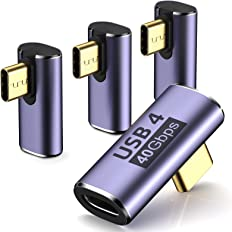 | $14   | USB C Right Angle Adapter (4 Pack) | [Amazon](https://www.amazon.com/gp/product/B0BBQX4SDR/ref=ppx_yo_dt_b_asin_title_o05_s00?ie=UTF8&th=1) |

https://www.amazon.com/gp/product/B0BBQX4SDR/ref=ppx_yo_dt_b_asin_title_o05_s00?ie=UTF8&th=1

## Software

* [Enfuse youtube](https://www.youtube.com/watch?v=Hsc7cOlUxdA)
* [Enfuse, Matt Jones](https://www.youtube.com/watch?v=4sIgiJqiZYU), has ineffective use of image list, can be simplified with shell script.
* [Helicon](https://www.heliconsoft.com/helicon-remote-stackshot/)

## Selected Arca Swiss Adapters

* [Koolehaoda QR-50B Quick Release Plate Clamp Double Clamp Adapter Compatible for Arca Swiss Plate RRS Rail Plate Nodal Slide Subtend](https://www.amazon.com/gp/product/B096DM6G7H/ref=ppx_yo_dt_b_asin_title_o00_s00?ie=UTF8&psc=1) $19, has build in lock feature for 180 and 90 degrees, good for macrostand builds with double sides arca swiss
* [Koolehaoda 400mm Rail Plate Multi-Purpose Dual Rail Quick Release Plate Aluminium Alloy Plate Compatible with Arca Swiss for Camera](https://www.amazon.com/gp/product/B0BJ9B1DHJ/ref=ppx_yo_dt_b_asin_title_o02_s00?ie=UTF8&psc=1) $30, very long, good for macrostand builds
* [UTEBIT 50mm Arca Swiss Quick Release Plate Aluminum QR Clamp Adapter Set with 3/8"&1/4" Screw Hole and Built-in Bubble Level](https://www.amazon.com/gp/product/B06ZZQSJBN/ref=ppx_yo_dt_b_asin_title_o07_s00?ie=UTF8&psc=1) $10, cheap, comes with arca swiss plate
* [FocusFoto P50 QR Clamp + 1/4" Quick Release Plate Set 50mm Adapter 3/8"](https://www.amazon.com/FocusFoto-Mounting-Universal-Compatible-Manfrotto/dp/B07F7CFZZF/ref=sr_1_14?crid=9NTLI4VHAW0M&keywords=arca+swiss+quick+release&qid=1673617312&s=electronics&sprefix=arca+swiss+quick+release%2Celectronics%2C150&sr=1-14) $14, has level instead of screw head, has security pin. 

## Selected Monfrotto Adapters

* [MEKNIC Camera Quick Release Plate Base Tripod Mount Adapter with QR Clamp Aluminum Alloy with 1/4" and 3/8" Screw Hole Compatible for Manfrotto 501HDV 503HDV 701HDV 577 519 561 Q5 7M1W](https://www.amazon.com/MEKNIC-Release-Aluminum-Compatible-Manfrotto/dp/B09FPDL25K/ref=psdc_3347851_t3_B06X3VSNF3) $15, real great plate, but I opted for arca swiss

## F38 Adapter

I realy like the F38 adapters in general. 

* [ULANZI F38 Camera Quick Release Plate w 1/4" to 3/8" Screw Thread, Quick Release System ](https://www.amazon.com/gp/product/B08P7GKR8W/ref=ppx_yo_dt_b_asin_title_o07_s00?ie=UTF8&psc=1) $33

## L Adapter

* [happypopo SLR Camera L-Bracket Vertical and Horizontal](amazon.com/gp/product/B09GB4XKGM/ref=ppx_yo_dt_b_asin_title_o07_s06?ie=UTF8&psc=1) $16, good adapter, cheap, however, it is screwed in, but that is stable enough, also allows the lpates to be used individually.

## Macro Rack Material

Gregor' Rack:

* 1 * [CheeMuii 2020 Corner Bracket Kit,20pcs](https://www.amazon.com/gp/product/B098NVHDYM/ref=ppx_yo_dt_b_asin_title_o03_s00?ie=UTF8&psc=1) $19
* 1 * [BELLA BAYS 4pcs 11.81 inch 300mm 2020 V Slot Aluminum Extrusion](https://www.amazon.com/gp/product/B08TBKLC5S/ref=ppx_yo_dt_b_asin_title_o03_s01?ie=UTF8&psc=1) $16
* 3 * [BELLA BAYS 1pcs 19.69 inch 500mm 2060 V Slot Aluminum Extrusion Profile](https://www.amazon.com/gp/product/B08XXKJZND/ref=ppx_yo_dt_b_asin_title_o03_s01?ie=UTF8&th=1) $18 each

## Streamers

* [Allan Walls Youtube](https://www.youtube.com/@AllanWallsPhotography)
  [Allen Walls Web Site](https://www.allanwallsphotography.com/) 
* [Micael Widell Youtube](https://www.youtube.com/@MicaelWidell)

## Links

* <https://blekenbleu.github.io/microscope/macro_links.htm>

## TODO

Links not yet checked

Cloudmakers (not tested):

* ~$22 each:
  * AstroDSLR <https://www.cloudmakers.eu/astrodslr>
  * MacroDSLR <https://www.cloudmakers.eu/macrodslr>
  * <https://youtu.be/cHQSUTkdk1E>